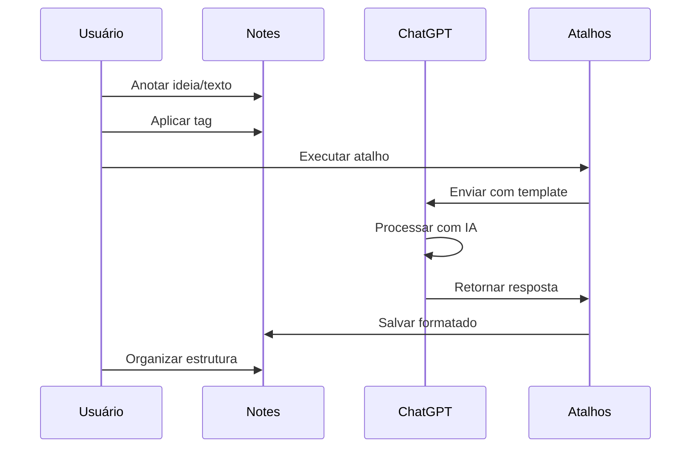
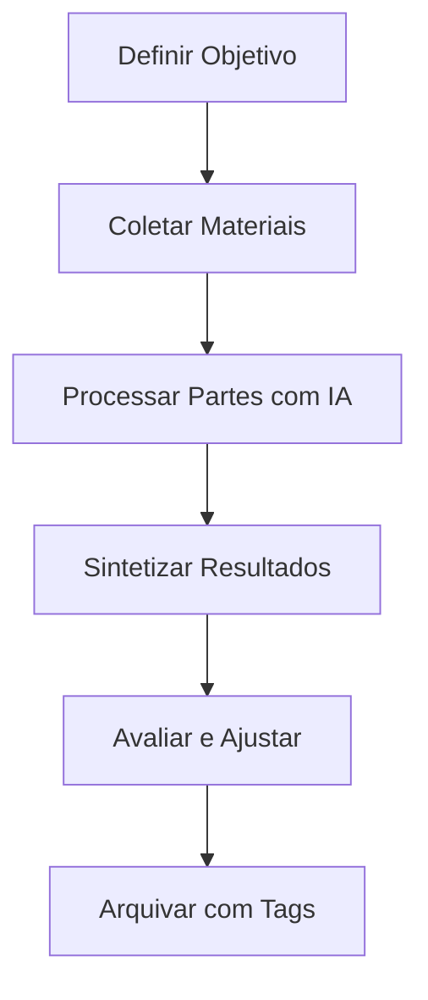

# Fluxos de Trabalho

## Diagrama de Processamento Diário

```mermaid
sequenceDiagram
    participant U as Usuário
    participant N as Notes
    participant C as ChatGPT
    participant A as Atalhos
    
    U->>N: Anotar ideia/texto
    U->>N: Aplicar tag #processar
    U->>A: Executar atalho
    A->>C: Enviar com template
    C->>C: Processar com IA
    C->>A: Retornar resposta
    A->>N: Salvar formatado
    U->>N: Organizar estrutura
```

## Diagrama de Projetos Complexos

```mermaid
flowchart TD
    A[Definir Objetivo] --> B[Coletar Materiais]
    B --> C[Processar Partes com IA]
    C --> D[Sintetizar Resultados]
    D --> E[Avaliar e Ajustar]
    E --> F[Arquivar com Tags]
```

---

**Data de Criação:** 30/11/2025  
**Status:** Processado  
**Categoria:** Fluxos de Trabalho
